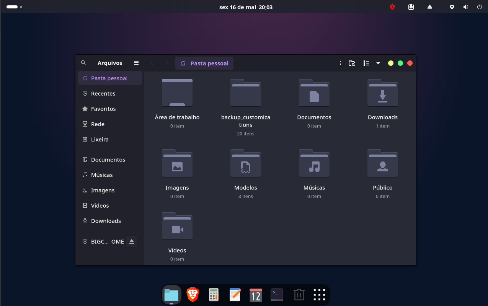
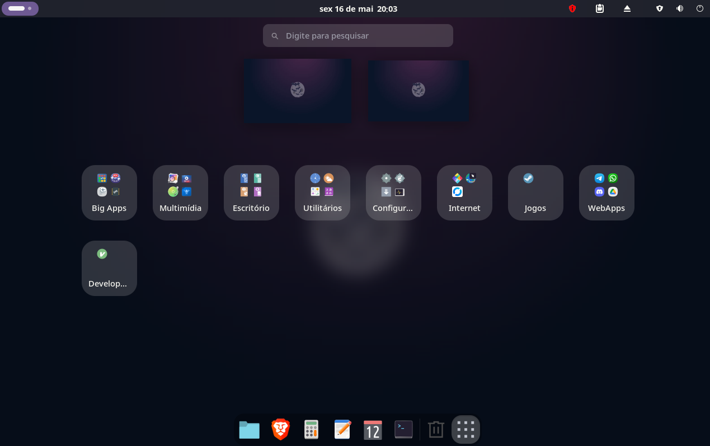

# comm-gnome-theme-dracula

Flat Remix is a material and colorful GNOME theme that includes:
- A custom GTK theme
- A matching icon set
- Adwaita-inspired cursor theme
- A stunning wallpaper to complete the look

This package is designed for Arch Linux and derivatives and specially for BigCommunity.

---

### 🎨 Screenshot:

---
## Features

- **Complete Customization**: Updates both GTK3 and GTK4 configurations.
- **Seamless Integration**: Applies the Dracula theme across icons, cursors, and wallpapers.
- **Backup Friendly**: Automatically creates backups of existing configurations during installation.

